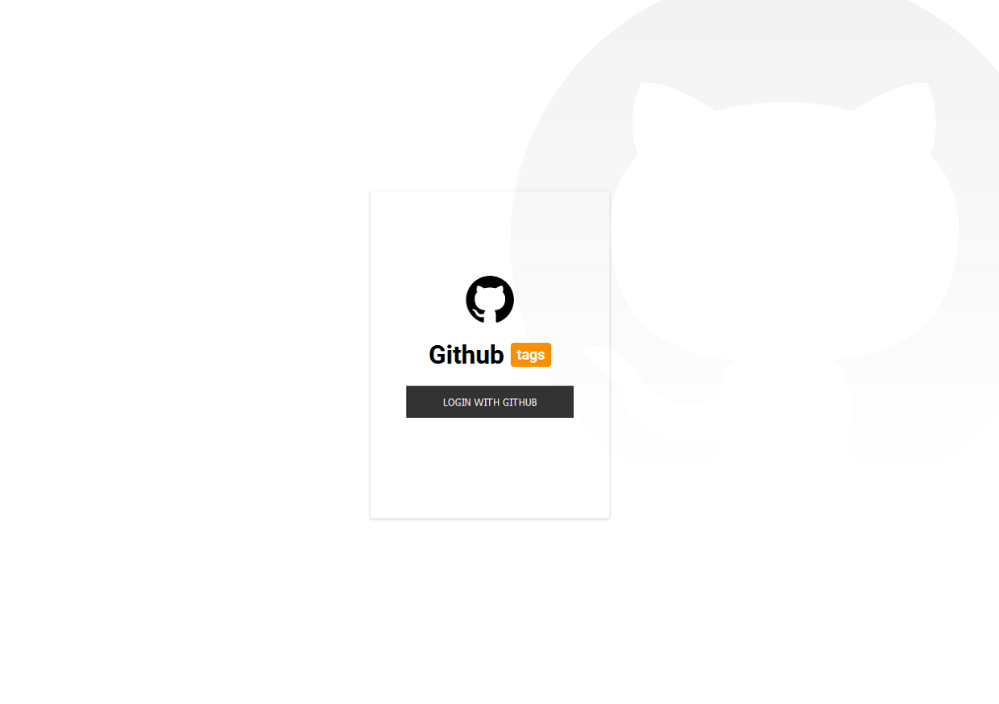

# project-github :octocat:


<p align=center>  

</p>

<p align=center>  


</p>

<p align=center>  


</p>

<p align=center>  

</p>


# Passos para executar este projeto:

## 1º - clonar e configurar o backend conforme instruções presentes no repositório de backend:     

https://github.com/maiconboer/project-github-backend

------------------------------------------


## 2º - Criar Github OAuth Apps, ele irá gerar credenciais para nosso podemos fazer o login com Github na nossa aplicação: 

Clique na sua foto no canto direito do github e vá em **Settings > Developer settings > Oauth Apps > New Oauth App**

Application name: ```project-github```   
Homepage URL: ```https://oauth.io```   
Authorization callback URL: ```https://oauth.io/auth```     

Será gerado então o **client_id** e **client_secret** (vamos utilizá-los)    


-----------------------------------------

## 3º - Acesse: 

https://oauth.io/signup  
Faça login com github  

Na **Dashboard**, em **Domains & URLs whitelist**, adicione:  

**localhost** (conforme imagem)

<p align=center>  

</p>

Salve as informações de App keys.  

Clique em **Integrated APIs** e em **+Add APIs**
Selecione **Github**

Em **Keys and Permission Scope**, preencha com:

**client_id:** (aquele que gerou dentro do Github, o OAuth Apps)
**client_secret:** (aquela que gerou dentro do Github, o OAuth Apps)
**scope:** **user**

<p align=center>  

</p>

-----------------------------------------

## 4º - Faça o clone deste repositório:     

    git clone https://github.com/maiconboer/project-github.git
    
    
Na raiz do projeto cliente uma variável de ambiente:

    nome: .env
    conteudo: REACT_APP_CLIENT_ID=seu_client_id_github_oauth_apps
              REACT_APP_CLIENT_SECRET=seu_client_secret_github_oauth_apps
              REACT_APP_REDIRECT_URI=http://localhost:3000/login
              REACT_APP_API_DB=http://localhost:4000
              REACT_APP_OAUTH_IO=sua_public_key_oauth_io
              
              
 <p align=center>  

</p>
              
   
 Para instalar as dependências, rode:

    yarn

-----------------------------------------
 
Após instalar as dependências, pode startar seu backend e também o frontend, para estar este frontend:

    yarn start
    
----------------------------------------- 


## Deploy realizado, do Front-end e Back-end:
https://project-github.herokuapp.com


-----------------------------------------

**O que podemos fazer na aplicação?**

Fazer autenticação e autorização de usuário;
Buscar todos os repositórios em que o usuário fornecido adicionou estrela;
Gerenciar tags de repositórios listados (por exemplo, adicionar, editar, excluir);
Filtrar repositórios por tags.


**HISTÓRIAS DE USUÁRIO**  

**Autenticação de usuário**  
Como usuário, quero me cadastrar e fazer login no sistema. Desejo que minhas tags e repositórios sejam vistos apenas por mim mesmo.

    Utilizando "login com o GitHub" para a autenticação.

**Buscar repositórios**  
Como usuário, desejo fornecer meu nome de usuário para recuperar todos os repositórios, para que eu possa adicionar, editar ou excluir minhas tags posteriormente.

    Usando a API do GitHub, obtenha repositórios com estrela. As informações que devem ser recuperadas são: id do repositório, nome do repositório, descrição e url HTTP.

**Adicionar tags aos repositórios**  
Como usuário, desejo poder adicionar tags a cada repositório para poder pesquisá-las posteriormente por tag.

    Um repositório não pode ter tags duplicadas.

**Pesquisar repositórios por tags**  

    Como usuário, desejo poder fornecer uma tag para listar os repositórios que têm essa tag associada.

A pesquisa deve funcionar para consultas com seqüências de caracteres ao meio (por exemplo, digitando doc, os repositórios com tag "docker" e "documentação" devem ser retornados).
