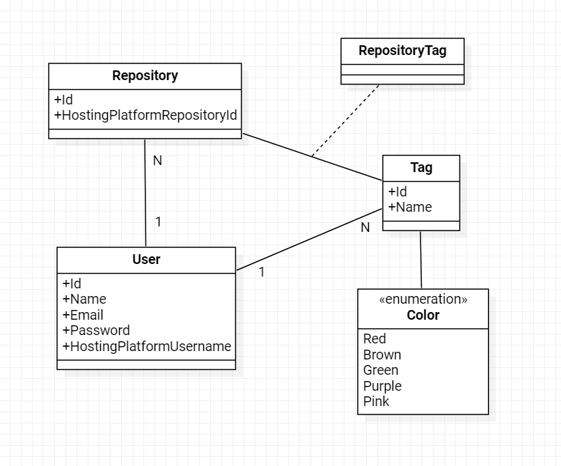

# Back-end

## Serviço RepoTag

### Modelage de domínio

A modelagem do domínio da aplicação foi pensada de modo a usar, junto a essa modelagem, a API da plataforma de hospedagem (no caso, o GitHub) para coletar informações em tempo de execução.

#### Entidades

##### User

Representa o usuário da aplicação.

- Id
- Name
- Email
- Password
- HostingPlatformUsername\
Nome do usuário da plataforma de hospedagem.

##### Tag

Representa a tag que serão associadas aos repositórios.

- Id
- Name
- Color\
Cor da tag (é um campo enum)

##### Repository

Representa o repositório da plataforma de hospedagem.

- Id
- HostingPlatformRepositoryId\
Id do repositório na plataforma de hospedagem.

##### RepositoryTag

Representa as tags dos repositórios.

- RepositoryId
- TagId

### Como executar

#### API

Pelo terminal:

1. Abra o terminal no diretório /back-end/RepoTag
2. Execute o comando:\
`$ dotnet run -p RepoTag.API`

Pelo Visual Studio Code:
1. Abra a aba "Run and Debug" (ou pressione Ctrl+Shif+D)
2. Clique no botão de Start Debugging

Pelo Visual Studio:

1. Abra o solution RepoTag.sln
2. Clique no botão "IIS Express" para executar a API

#### Testes

Pelo terminal:

1. Abra o terminal no diretório /back-end/RepoTag
2. Execute o comando:\
`$ dotnet test RepoTag.Test`

Pelo Visual Studio Code:

1. Instale a extensão: formulahendry.dotnet-test-explorer
2. ... [em construção]

Pelo Visual Studio:

1. Abra o solution RepoTag.sln
2. Vá em View > Test Explorer
3. Abra a aba Test Explorer
4. Utilize os botões da interface para execução dos testes.

### Bibliotecas utilizadas

#### RepoTag.API

- `Microsoft.AspNetCore.Authentication`
- `Microsoft.AspNetCore.Authentication.JwtBearer`

#### RepoTag

- `RestEase`: Fazer chamadas HTTP

#### RepoTag.Test

- `Bogus`: facilita para criar objetos "Fake" para os testes unitários
- `MOQ`: criar mocks nos testes unitários e isolar ainda mais os testes.

### Melhorias futuras

- Hash do Password no banco de dados (a senha está sem salva "crua")
- Estruturas dos testes: o "Arrange" ficou bem verboso, com algumas duplicações de código
- Retorno de erros em Português e não em Inglês\
    Motivo de não utilizar Inglês: aproveitamento da mensagem erro na interface (que será em pt-br)

- Métodos privados para Mapeamento\
    Melhoria: Usar AutoMapper

Motivo de não priorizar as melhorias: podem ser implementadas futuramente sem precisar de grandes *refactors*.

### Casos de uso

##### Use Case: 1. Como usuário, quero me cadastrar \[...\]

Método associado:
`RepoTag.Application.Services.UserAppService.Create`

##### Use Case: 1. \[...\] fazer login no sistema.

Método associado:
`RepoTag.Application.Services.UserAppService.Get`

##### Use Case: 2. Como usuário, desejo fornecer meu nome de usuário para recuperar todos os repositórios\[...\]

Método associado:
`RepoTag.Application.Services.TagAppService.GetRepoTags`

##### Use Case: 2. \[...\] para que eu possa adicionar, editar ou excluir minhas tags posteriormente.

Método associado:
`RepoTag.Application.Services.TagAppService.UpsertAndRemove`

##### Use Case: 3. Como usuário, desejo poder adicionar tags a cada repositório para poder pesquisá-las posteriormente por tag.

Método associado:
`RepoTag.Application.Services.TagAppService.InsertOrRemoveTags`

